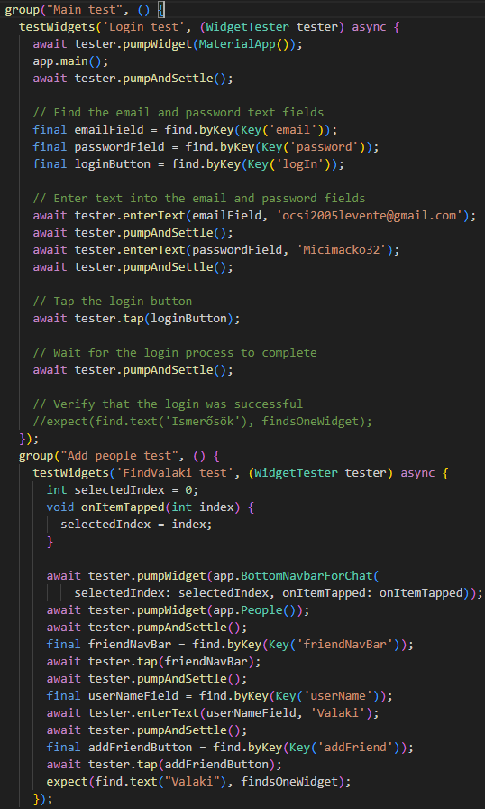

# 
 *Chatex*   Dokumentáció 

  

---

# Tartalomjegyzék
1. Tartalomjegyzék
2. [Bevezetés](#bevezetes)
-  2.1 [A feladat címe](#cim)
- 2.2 [A feladat rövid ismertetése](#ismertetes)
3. [Elvárások a feladattal kapcsolatban](#elvarasok)
- 3.1  [Környezet](#kornyezet)
- 3.2  [Felhasználandó programozási nyelv](#nyelv)
- 3.3 [Megoldás Formátuma](#formatum)
- 3.4 [Szoftverfejlesztés](#szoftverfejlesztes)
- 3.5 [Modulok](#modulok)
4. [Specifikáció](#spec)
- 4.1 [Megjelenés](#megj)
- 4.2 [Funkciók](#funkciok)
5. [Tesztelés](#teszt)
- 5.1 [Forráskód dokumentáció]()
- 5.2 [Felhasználói dokumentáció]()
6. [A projekt értékelése]()
- 6.1 [A feladat értékelésének felhasználói oldali szempontjai]()
- 6.2 [A feladat értékelésének technikai szempontjai]() 
7. [Projekt adatlap]()

---
# 2 Bevezetés
## 2.1 A feladat címe
Chatex chat alkalmazás 
## 2.2 A feladat rövid ismertetése
Vizsgaremekünk egy modern, gyors és biztonságos chat alkalmazás, amely túlmutat a hagyományos üzenetküldő platformokon, például a Messenger-en. Az alkalmazás célja, hogy felhasználóbarát felületet és fejlett funkciókat biztosítson a kommunikációhoz, miközben a stabilitásra és adatvédelemre is kiemelt figyelmet fordítunk.

### Főbb jellemzők:

- Villámgyors üzenetküldés késleltetés nélkül
- Biztonságos adatkezelés és titkosítás a felhasználói adatok védelmében
- Modern, letisztult felület, amely könnyen kezelhető
- Innovatív funkciók, amelyekkel az élmény még jobb, mint a hagyományos alkalmazásokban

  

---

# 3 Elvárások a feladattal kapcsoltban 
## 3.1 Operációs rendszer, környezet
- Android
## 3.2 Felhasználandó programozási nyelv
- Nincs megkötés
- Flutter, Dart, PHP(Backend)

## 3.3 Megoldás formátuma
- Forráskód állományok
- Teljes projekt környezet
- Forráskód dokumentáció

# 3.4 Szoftverfejlesztés
A projekt célja egy biztonságos és modern chat alkalmazás fejlesztése, amely túlmutat a hagyományos üzenetküldő megoldásokon. Az alkalmazás lehetőséget biztosít chatek, csoportok, létrehozására miközben kiemelt figyelmet fordít a felhasználói élményre és teljesítményre. 
**A fejlesztés közben be kell tartani a Clean Code alapszabályait.** 

--- 

# 4  Specifikáció
##  4.1 Megjelenés
- Főoldal

Az alkalmazás/weboldal megnyitása után megjelenő felület (ha a felhasználó nincs
bejelentkezve). 

A felületen található: 

o felhasználónév 

o jelszó mező 

o bejelentkezés gomb 

o regisztráció gomb 

o elfelejtett jelszó 

- Regisztráció  
A főoldalon található regisztráció gomb megnyomása után megjelenő felület,
amely a következő beviteli mezőket tartalmazza
    -  o felhasználónév
    -  o E-mailcím
    -  o jelszó
    -  o jelszó újra

- Chat lista  
Bejelentkezett felhasználóknak megjelenő felület, ahol listás nézetben megjelenik
a felhasználó számára elérhető összes chatszoba.
- Chat felület  
A chat listán egy chat szobára kattintva megjelenik annak felülete. A felhasználók
ezen a felületen tudnak a chat szoba tagjainak üzenetet küldeni, illetve itt láthatják
a többi felhasználó által küldött üzeneteket. Az üzenetek felett fel kell tüntetni az
üzenetet küldő felhasználók becenevét (ha nincs beállítva, a felhasználónevét).
- Profil felület  
Bejelentkezés után elérhető felület. A felhasználó ezen a felületen tudja módosítani
a jelszavát és az üzenetküldéskor megjelenő becenevét.

---
# 4.2  Funkciók

- Regisztráció  
A program használatához regisztráció szükséges (regisztráció felület).

- Üzenetküldés  
Az alkalmazás legfőbb funkciója.
A küldött üzeneteket tetszőleges módon megvalósított E2E titkosítással kell
kezelni. 

- Chatszoba létrehozása  
A felhasználók chatszobákat hozhatnak létre, és közvetlenül hozzáadhatják ismerőseiket a beszélgetéshez. Csak azok csatlakozhatnak, akiket a létrehozó hozzáadott, és akik elfogadták az ismerősnek jelölést.

- Profil kezelés  
Saját jelszó és becenév módosítás. 

---

#  5  Dokumentáció

## Forráskód dokumentáció:
## Felhsználói dokumentáció:
### A program részletes bemutatása
Bejelentkezés és regisztráció:

- Az alkalmazás első megnyitásakor a bejelentkezésnél taáljuk magunkat, de mivel regisztráció szükséges
az alkalmazás használatához ezért a regisztációs gombra kattintva ezt meg is tehetjük
egy E-mail cím és egy jelszó megadásával a regisztrációs gombra kattintva.
Regisztráció után a felhasználó bejelentkezhet a megadott adatokkal.

Üzenetküldés és fogadás:
- Kattintson a jobb lent található Ismerősök gombra ahol megtalálhatja ismerőseit
barátait a kereső használata segítségével. Miután megtalálta a személyt akinek üzeneteket
szeretne küldeni a bal lent található csevegések gombra kattintva találja ezt a beszélgetést.
Itt a chatbe belépve küldhet üzenetet ismerősének.

Csoportos chat létrehozása:
- A csoportos chatet a bal fent található menü fülön belül a csoport létrehozása gombra
kattintva hozhat létre. Miután ezt megtette válassza ki, hogy kiket szeretne bevenni
a csoportba és, hogy mire szeretné elnevezni, ezek megtétele után a csopportos chat 
megtalálható lesz a fent emlíett Chatek fülben.

Beállítások:
- A beállításokat a bal fent lévő menü fülben találja meg, amikor rákattint a beállítások
fülre, ott találja magát a beállításokban ahol a nyelvet, értesítéseket, account fül alatt a profilkép 
megváltoztatás és felhasználónév megváltoztatást hajthat végre, ezen kívül a beállításokban 
még a jelszót is megváltoztathatja.

## Tesztelés fajtái:

- Integration test 

