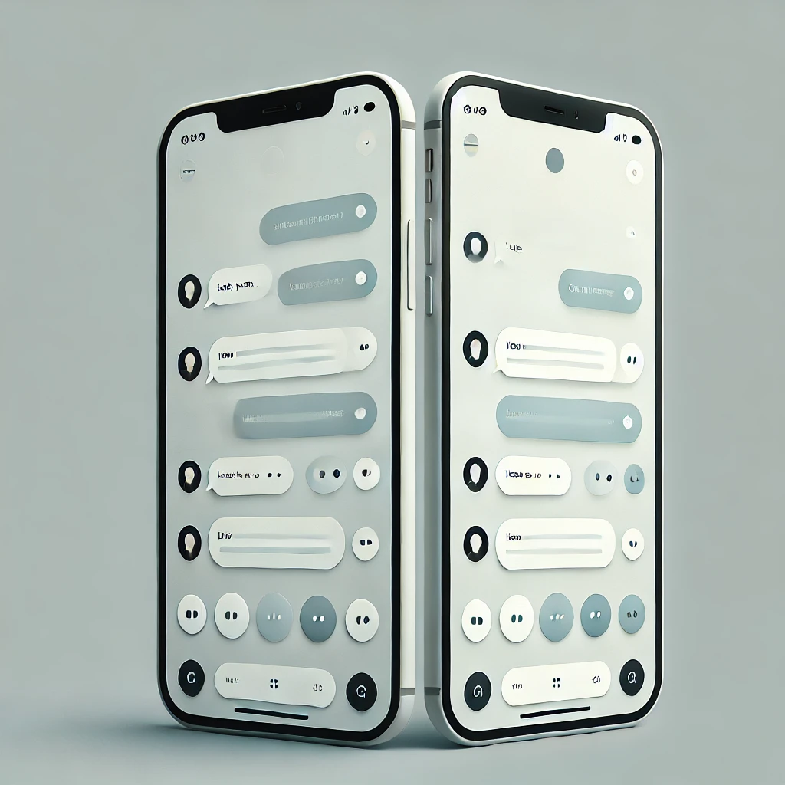

# 
*Chatex*   Dokumentáció 

  

---

# Tartalomjegyzék
1. Tartalomjegyzék
2. [Bevezetés](#bevezetes)
-  2.1 [A feladat címe](#cim)
- 2.2 [A feladat rövid ismertetése](#ismertetes)
3. [Elvárások a feladattal kapcsolatban](#elvarasok)
- 3.1  [Környezet](#kornyezet)
- 3.2  [Felhasználandó programozási nyelv](#nyelv)
- 3.3 [Megoldás Formátuma](#formatum)
- 3.4 [Szoftverfejlesztés](#szoftverfejlesztes)
- 3.5 [Modulok]()
4. [Specifikáció]()
- 4.1 [Megjelenés]()
- 4.2 [Funkciók]()
- 4.3 [Titkosítás]()
5. [Dokumentáció]()
- 5.1 [Erőforrásterv, munkaidő-nyilvántartás]()
- 5.2 [Forráskód dokumentáció]()
- 5.3 [Felhasználói dokumentáció]()
6. [A projekt értékelése]()
- 6.1 [A feladat értékelésének felhasználói oldali szempontjai]()
- 6.2 [A feladat értékelésének technikai szempontjai]() 
7. [Projekt adatlap]()

---
# 2 Bevezetés
## 2.1 A feladat címe
Chatex chat alkalmazás 
## 2.2 A feladat rövid ismertetése
Vizsgaremekünk egy modern, gyors és biztonságos chat alkalmazás, amely túlmutat a hagyományos üzenetküldő platformokon, például a Messenger-en. Az alkalmazás célja, hogy felhasználóbarát felületet és fejlett funkciókat biztosítson a kommunikációhoz, miközben a stabilitásra és adatvédelemre is kiemelt figyelmet fordítunk.

### Főbb jellemzők:

- Villámgyors üzenetküldés késleltetés nélkül
- Biztonságos adatkezelés és titkosítás a felhasználói adatok védelmében
- Modern, letisztult felület, amely könnyen kezelhető
- Innovatív funkciók, amelyekkel az élmény még jobb, mint a hagyományos alkalmazásokban

  

---

# 3 Elvárások a feladattal kapcsoltban 
## 3.1 Operációs rendszer, környezet
- Android
## 3.2 Felhasználandó programozási nyelv
- Nincs megkötés
- Flutter, Dart, PHP(Backend)

## 3.3 Megoldás formátuma
- Forráskód állományok
- Teljes projekt környezet
- Forráskód dokumentáció
- Erőforrás terv és munkaidő nyilvántartás

# 3.4 Szoftverfejlesztés
A projekt célja egy biztonságos és modern chat alkalmazás fejlesztése, amely túlmutat a hagyományos üzenetküldő megoldásokon. Az alkalmazás lehetőséget biztosít chatek, csoportok, létrehozására miközben kiemelt figyelmet fordít a felhasználói élményre és teljesítményre. 
**A fejlesztés közben be kell tartani a Clean Code alapszabályait.** 

--- 

# 4 Specifikáció

- Főoldal

Az alkalmazás/weboldal megnyitása után megjelenő felület (ha a felhasználó nincs
bejelentkezve). 

A felületen található: 

o felhasználónév 

o jelszó mező 

o bejelentkezés gomb 

o regisztráció gomb 

o elfelejtett jelszó 

- Regisztráció  
A főoldalon található regisztráció gomb megnyomása után megjelenő felület,
amely a következő beviteli mezőket tartalmazza
    -  o felhasználónév
    -  o E-mailcím
    -  o jelszó
    -  o jelszó újra

- Chat lista  
Bejelentkezett felhasználóknak megjelenő felület, ahol listás nézetben megjelenik
a felhasználó számára elérhető összes chatszoba.

